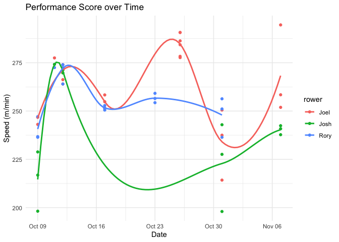
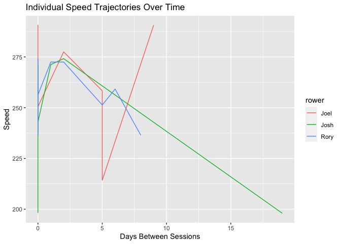
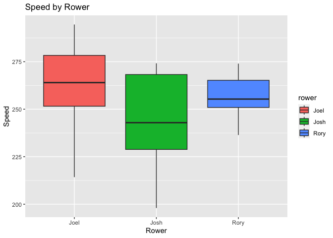
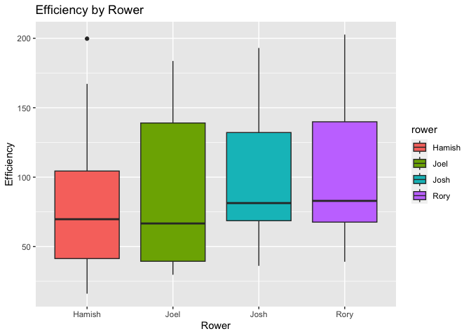
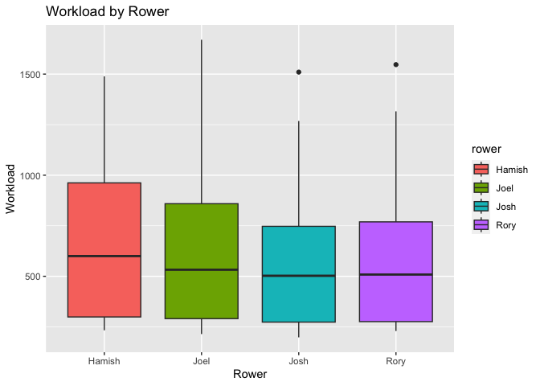
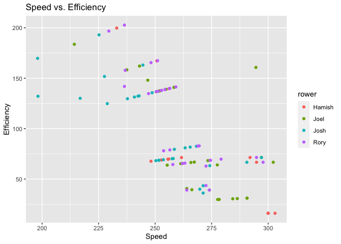

Newcastle ’97ers rowing performance tracking
================

``` r
library(tidyverse)
library(googlesheets4)
library(lme4)
library(lubridate)
library(janitor)
library(skimr)
library(here)

gs_url <- "https://docs.google.com/spreadsheets/d/1GxCmTZ8E1-y-wfgvKNHqYh4cazBaKz2s1CS8alvqQ-Q/edit#gid=935753699"
rowing_data <- read_sheet(gs_url, sheet = "Erg Times") %>% clean_names()

skim(rowing_data)
```

|                                                  |             |
|:-------------------------------------------------|:------------|
| Name                                             | rowing_data |
| Number of rows                                   | 106         |
| Number of columns                                | 6           |
| \_\_\_\_\_\_\_\_\_\_\_\_\_\_\_\_\_\_\_\_\_\_\_   |             |
| Column type frequency:                           |             |
| character                                        | 1           |
| numeric                                          | 4           |
| POSIXct                                          | 1           |
| \_\_\_\_\_\_\_\_\_\_\_\_\_\_\_\_\_\_\_\_\_\_\_\_ |             |
| Group variables                                  | None        |

Data summary

**Variable type: character**

| skim_variable | n_missing | complete_rate | min | max | empty | n_unique | whitespace |
|:--------------|----------:|--------------:|----:|----:|------:|---------:|-----------:|
| rower         |         0 |             1 |   4 |   6 |     0 |        5 |          0 |

**Variable type: numeric**

| skim_variable | n_missing | complete_rate |    mean |     sd |     p0 |    p25 |     p50 |     p75 | p100 | hist  |
|:--------------|----------:|--------------:|--------:|-------:|-------:|-------:|--------:|--------:|-----:|:------|
| erg_no        |         0 |             1 |    2.37 |   1.40 |   1.00 |    1.0 |    2.00 |    3.00 |    6 | ▇▃▁▁▁ |
| time_mins     |         0 |             1 |    8.08 |   3.46 |   1.65 |    6.0 |    6.78 |   12.00 |   12 | ▂▂▇▂▇ |
| distance      |         0 |             1 | 2059.33 | 797.23 | 500.00 | 1534.5 | 2000.00 | 2904.25 | 3535 | ▅▇▅▅▆ |
| stroke_rate   |         0 |             1 |   23.55 |   4.09 |  14.00 |   22.0 |   23.00 |   26.00 |   31 | ▁▂▇▃▃ |

**Variable type: POSIXct**

| skim_variable | n_missing | complete_rate | min        | max        | median     | n_unique |
|:--------------|----------:|--------------:|:-----------|:-----------|:-----------|---------:|
| date          |         0 |             1 | 2023-10-09 | 2024-01-16 | 2023-11-14 |       15 |

# Metric Derivation

``` r
calculate_days_between <- function(data) {
  
  # do the calc
  data <- data %>%
    arrange(rower, date) %>%
    group_by(rower) %>%
    mutate(
      # Calculate days between sessions including zeros
      days_between_sessions = as.numeric(difftime(date, lag(date, default = date[1]), units = "days"))
    ) %>%
    ungroup() # Ensure that subsequent operations are not affected by grouping
  
  # Replace zeros with NAs to ignore same-day sessions
  data <- data %>%
    group_by(rower) %>%
    mutate(
      days_between_sessions = ifelse(days_between_sessions == 0, NA, days_between_sessions)
    ) %>%
    fill(days_between_sessions, .direction = "down") %>%
    ungroup()

}

calculate_speed <- function(data) {
  data %>% mutate(speed = distance / time_mins)
}

calculate_efficiency <- function(data) {
  data %>% mutate(efficiency = distance / stroke_rate)
}

calculate_workload <- function(data) {
  data %>% mutate(workload = speed * erg_no)
}

calculate_burnout_index <- function(data) {
  data %>% mutate(burnout_index = workload / days_between_sessions - efficiency)
}

calculate_relative_improvement <- function(data) {
  data %>%
    group_by(rower) %>%
    mutate(baseline_speed = first(speed),
           relative_improvement = (speed - baseline_speed) / baseline_speed * 100)
}

processed_data <- rowing_data %>%
  calculate_days_between() %>%
  calculate_speed() %>%
  calculate_efficiency() %>%
  calculate_workload() %>%
  calculate_burnout_index() %>%
  calculate_relative_improvement()
```

``` r
summary_stats <- processed_data %>%
  group_by(rower) %>%
  summarise(
    avg_speed = mean(speed, na.rm = TRUE),
    avg_efficiency = mean(efficiency, na.rm = TRUE),
    total_distance = sum(distance, na.rm = TRUE),
    total_time = sum(time_mins, na.rm = TRUE),
    avg_burnout_index = mean(burnout_index, na.rm = TRUE)
  )

print(summary_stats)
```

    ## # A tibble: 5 × 6
    ##   rower  avg_speed avg_efficiency total_distance total_time avg_burnout_index
    ##   <chr>      <dbl>          <dbl>          <dbl>      <dbl>             <dbl>
    ## 1 Hamish      270.           79.6          25548       98.3              46.6
    ## 2 James       279.           63.7           5023       18               NaN  
    ## 3 Joel        267.           87.8          56659      217.               46.0
    ## 4 Josh        250.           99.5          59496      244.               22.1
    ## 5 Rory        260.          107.           71563      280.               12.7

``` r
ggplot(processed_data, aes(x = date, y = burnout_index, color = rower)) +
  geom_point() +
  geom_smooth(se = F) +
  labs(title = "Burnout Index Over Time",
       y = "Burnout Index",
       x = "Date") +
  theme_minimal()
```

<!-- -->

``` r
ggplot(processed_data, aes(x = date, y = relative_improvement, color = rower)) +
  geom_point() +
  geom_smooth(se = FALSE) +
  labs(title = "Relative Improvement Over Time",
       y = "Improvement (%)",
       x = "Date") +
  theme_minimal()
```

<!-- -->

``` r
ggplot(processed_data, aes(x = date, y = efficiency, color = rower)) +
  geom_point() +
  geom_smooth(se = FALSE) +  # 'se = FALSE' removes the shading around the trend line.
  labs(title = "Stroke Efficiency Over Time",
       y = "Efficiency (distance/stroke rate)",
       x = "Date") +
  theme_minimal()
```

<!-- -->

``` r
ggplot(processed_data, aes(x = date, y = speed, color = rower)) +
  geom_point() +
  geom_smooth(se = FALSE) +
  labs(title = "Performance Score over Time",
       y = "Speed (m/min)",
       x = "Date") +
  theme_minimal()
```

<!-- -->

``` r
# Mixed-Effects Model
speed_model <- lmer(speed ~ days_between_sessions + (1 + days_between_sessions|rower), data=processed_data)
speed_model <- lmer(speed ~ days_between_sessions + (1|rower), data=processed_data)
summary(speed_model)
```

    ## Linear mixed model fit by REML ['lmerMod']
    ## Formula: speed ~ days_between_sessions + (1 | rower)
    ##    Data: processed_data
    ## 
    ## REML criterion at convergence: 820.3
    ## 
    ## Scaled residuals: 
    ##     Min      1Q  Median      3Q     Max 
    ## -3.2607 -0.6062 -0.2960  0.7610  1.9521 
    ## 
    ## Random effects:
    ##  Groups   Name        Variance Std.Dev.
    ##  rower    (Intercept)  33.15    5.757  
    ##  Residual             363.12   19.056  
    ## Number of obs: 94, groups:  rower, 4
    ## 
    ## Fixed effects:
    ##                       Estimate Std. Error t value
    ## (Intercept)           257.5908     4.2838  60.132
    ## days_between_sessions   0.4683     0.2085   2.246
    ## 
    ## Correlation of Fixed Effects:
    ##             (Intr)
    ## dys_btwn_ss -0.572

``` r
# Visualizations

# Individual trajectories of speed over time
ggplot(processed_data, aes(x=days_between_sessions, y=speed, color=rower)) +
  geom_line() +
  labs(title="Individual Speed Trajectories Over Time", x="Days Between Sessions", y="Speed")
```

    ## Warning: Removed 12 rows containing missing values (`geom_line()`).

<!-- -->

``` r
# Boxplots for speed, efficiency, and workload
metrics_list <- list("Speed" = processed_data$speed,
                    "Efficiency" = processed_data$efficiency,
                    "Workload" = processed_data$workload)

for(metric_name in names(metrics_list)) {
  print(ggplot(processed_data, aes(x=rower, y=metrics_list[[metric_name]], fill=rower)) +
    geom_boxplot() +
    labs(title=paste(metric_name, "by Rower"), x="Rower", y=metric_name))
}
```

<!-- --><!-- --><!-- -->

``` r
# Scatter plot of speed vs efficiency
ggplot(processed_data, aes(x=speed, y=efficiency, color=rower)) +
  geom_point() +
  labs(title="Speed vs. Efficiency", x="Speed", y="Efficiency")
```

<!-- -->
