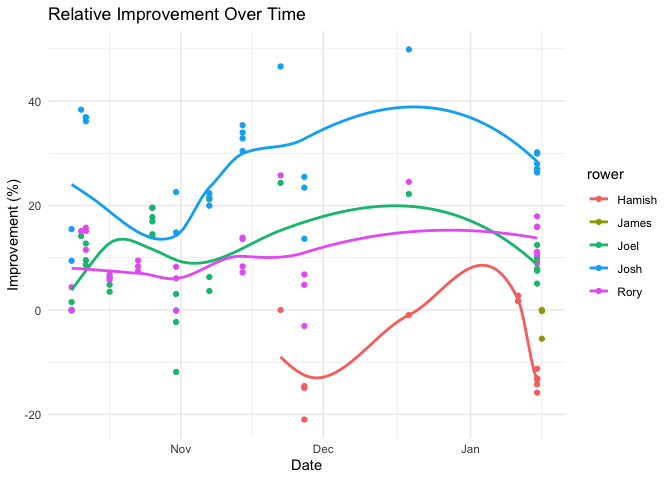
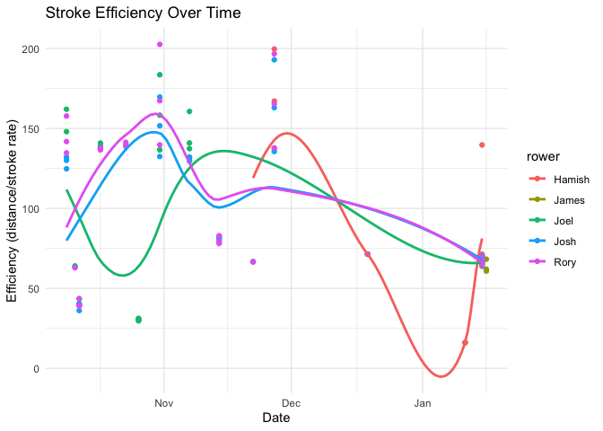

Newcastle ’97ers rowing performance tracking
================

``` r
library(tidyverse)
library(googlesheets4)
library(lubridate)
library(janitor)
library(skimr)
library(here)

gs_url <- "https://docs.google.com/spreadsheets/d/1GxCmTZ8E1-y-wfgvKNHqYh4cazBaKz2s1CS8alvqQ-Q/edit#gid=935753699"
rowing_data <- read_sheet(gs_url, sheet = "Erg Times") %>% clean_names()

skim(rowing_data)
```

|                                                  |             |
|:-------------------------------------------------|:------------|
| Name                                             | rowing_data |
| Number of rows                                   | 44          |
| Number of columns                                | 6           |
| \_\_\_\_\_\_\_\_\_\_\_\_\_\_\_\_\_\_\_\_\_\_\_   |             |
| Column type frequency:                           |             |
| character                                        | 1           |
| numeric                                          | 4           |
| POSIXct                                          | 1           |
| \_\_\_\_\_\_\_\_\_\_\_\_\_\_\_\_\_\_\_\_\_\_\_\_ |             |
| Group variables                                  | None        |

Data summary

**Variable type: character**

| skim_variable | n_missing | complete_rate | min | max | empty | n_unique | whitespace |
|:--------------|----------:|--------------:|----:|----:|------:|---------:|-----------:|
| rower         |         0 |             1 |   4 |   4 |     0 |        3 |          0 |

**Variable type: numeric**

| skim_variable | n_missing | complete_rate |    mean |     sd |  p0 |  p25 |    p50 |  p75 | p100 | hist  |
|:--------------|----------:|--------------:|--------:|-------:|----:|-----:|-------:|-----:|-----:|:------|
| erg_no        |         0 |             1 |    2.11 |   1.15 |   1 |    1 |    2.0 |    3 |    6 | ▇▃▁▁▁ |
| time_mins     |         0 |             1 |    8.73 |   4.03 |   3 |    4 |   12.0 |   12 |   12 | ▅▁▁▁▇ |
| distance      |         0 |             1 | 2156.18 | 920.40 | 833 | 1085 | 2666.5 | 3006 | 3110 | ▆▁▁▂▇ |
| stroke_rate   |         0 |             1 |   22.89 |   4.24 |  14 |   20 |   22.0 |   27 |   30 | ▂▅▇▃▇ |

**Variable type: POSIXct**

| skim_variable | n_missing | complete_rate | min        | max        | median     | n_unique |
|:--------------|----------:|--------------:|:-----------|:-----------|:-----------|---------:|
| date          |         0 |             1 | 2023-10-09 | 2023-10-31 | 2023-10-17 |        7 |

``` r
calculate_days_between <- function(data) {
  data %>%
    arrange(rower, date) %>%
    group_by(rower) %>%
    mutate(days_between_sessions = date - lag(date, default = first(date)))
}

calculate_speed <- function(data) {
  data %>% mutate(speed = distance / time_mins)
}

calculate_efficiency <- function(data) {
  data %>% mutate(efficiency = distance / stroke_rate)
}

calculate_workload <- function(data) {
  data %>% mutate(workload = speed * erg_no)
}

calculate_burnout_index <- function(data) {
  data %>% mutate(burnout_index = workload / days_between_sessions - efficiency)
}

calculate_days_between <- function(data) {
  data %>%
    arrange(rower, date) %>%
    group_by(rower) %>%
    mutate(days_between_sessions = as.numeric(date - lag(date, default = first(date))))
}

calculate_relative_improvement <- function(data) {
  data %>%
    group_by(rower) %>%
    mutate(baseline_speed = first(speed),
           relative_improvement = (speed - baseline_speed) / baseline_speed * 100)
}

processed_data <- rowing_data %>%
  calculate_days_between() %>%
  calculate_speed() %>%
  calculate_efficiency() %>%
  calculate_workload() %>%
  calculate_burnout_index() %>%
  calculate_relative_improvement()

summary_stats <- processed_data %>%
  group_by(rower) %>%
  summarise(
    avg_speed = mean(speed, na.rm = TRUE),
    avg_efficiency = mean(efficiency, na.rm = TRUE),
    total_distance = sum(distance, na.rm = TRUE),
    total_time = sum(time_mins, na.rm = TRUE),
    avg_burnout_index = mean(burnout_index, na.rm = TRUE)
  )

print(summary_stats)
```

    ## # A tibble: 3 × 6
    ##   rower avg_speed avg_efficiency total_distance total_time avg_burnout_index
    ##   <chr>     <dbl>          <dbl>          <dbl>      <dbl>             <dbl>
    ## 1 Joel       264.           87.3          33488        132               Inf
    ## 2 Josh       240.          102.           20642         90               Inf
    ## 3 Rory       254.          123.           40742        162               Inf

``` r
ggplot(processed_data, aes(x = date, y = burnout_index, color = rower)) +
  geom_point() +
  geom_smooth(se = FALSE) +
  labs(title = "Burnout Index Over Time",
       y = "Burnout Index",
       x = "Date") +
  theme_minimal()
```

<!-- -->

``` r
ggplot(processed_data, aes(x = date, y = relative_improvement, color = rower)) +
  geom_point() +
  geom_smooth(se = FALSE) +
  labs(title = "Relative Improvement Over Time",
       y = "Improvement (%)",
       x = "Date") +
  theme_minimal()
```

<!-- -->

``` r
ggplot(processed_data, aes(x = date, y = efficiency, color = rower)) +
  geom_point() +
  geom_smooth(se = FALSE) +  # 'se = FALSE' removes the shading around the trend line.
  labs(title = "Stroke Efficiency Over Time",
       y = "Efficiency (distance/stroke rate)",
       x = "Date") +
  theme_minimal()
```

<!-- -->

``` r
ggplot(processed_data, aes(x = date, y = speed, color = rower)) +
  geom_point() +
  geom_smooth(se = FALSE) +
  labs(title = "Performance Score over Time",
       y = "Speed (m/min)",
       x = "Date") +
  theme_minimal()
```

<!-- -->
